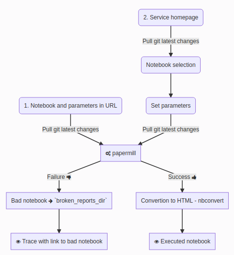

# Papermill Jupyter report

[](https://anaconda.org/conda-forge/papermill_report)
[](https://github.com/ariadnext/papermill_report/actions?query=workflow%3ATest)

Microservice to generate Jupyter reports by executing notebook and exporting them to static HTML page combining [papermill](https://papermill.readthedocs.io/en/latest/) and [nbconvert](nbconvert.readthedocs.io/).

It can be run as a standalone application or as a JupyterHub service.

](./docs/demo.gif)

The workflow is described in the figure below. You can either:
1. Set a specific URL to select a notebook and pass query arguments as parameters,
2. Or interactively select one notebook and set its parameters.

[](https://mermaid-js.github.io/mermaid-live-editor/#/edit/eyJjb2RlIjoiZ3JhcGggVERcbiAgQSgyLiBTZXJ2aWNlIGhvbWVwYWdlKSAtLT58UHVsbCBnaXQgbGF0ZXN0IGNoYW5nZXN8IEIoTm90ZWJvb2sgc2VsZWN0aW9uKVxuICBCIC0tPiBDKFNldCBwYXJhbWV0ZXJzKVxuICBDMSgxLiBOb3RlYm9vayBhbmQgcGFyYW1ldGVycyBpbiBVUkwpIC0tPnxQdWxsIGdpdCBsYXRlc3QgY2hhbmdlc3wgRFxuICBDIC0tPnxQdWxsIGdpdCBsYXRlc3QgY2hhbmdlc3wgRFtmYTpmYS1jb2dzIHBhcGVybWlsbCAgLl1cbiAgRCAtLT58RmFpbHVyZSBmYTpmYS10aHVtYnMtZG93biAgLnwgRTJbQmFkIG5vdGVib29rIGZhOmZhLWFycm93LXJpZ2h0IGBicm9rZW5fcmVwb3J0c19kaXJgICAuXVxuICBFMiAtLT4gRjJbZmE6ZmEtZXllIFRyYWNlIHdpdGggbGluayB0byBiYWQgbm90ZWJvb2sgIC5dXG4gIEQgLS0-fFN1Y2Nlc3MgZmE6ZmEtdGh1bWJzLXVwICAufCBFW0NvbnZlcnRpb24gdG8gSFRNTCAtIG5iY29udmVydF1cbiAgRSAtLT4gRltmYTpmYS1leWUgRXhlY3V0ZWQgbm90ZWJvb2sgIC5dXG5cdFx0IiwibWVybWFpZCI6eyJ0aGVtZSI6ImRlZmF1bHQiLCJ0aGVtZVZhcmlhYmxlcyI6eyJiYWNrZ3JvdW5kIjoidHJhbnNwYXJlbnQiLCJwcmltYXJ5Q29sb3IiOiIjRUNFQ0ZGIiwic2Vjb25kYXJ5Q29sb3IiOiIjZmZmZmRlIiwidGVydGlhcnlDb2xvciI6ImhzbCg4MCwgMTAwJSwgOTYuMjc0NTA5ODAzOSUpIiwicHJpbWFyeUJvcmRlckNvbG9yIjoiaHNsKDI0MCwgNjAlLCA4Ni4yNzQ1MDk4MDM5JSkiLCJzZWNvbmRhcnlCb3JkZXJDb2xvciI6ImhzbCg2MCwgNjAlLCA4My41Mjk0MTE3NjQ3JSkiLCJ0ZXJ0aWFyeUJvcmRlckNvbG9yIjoiaHNsKDgwLCA2MCUsIDg2LjI3NDUwOTgwMzklKSIsInByaW1hcnlUZXh0Q29sb3IiOiIjMTMxMzAwIiwic2Vjb25kYXJ5VGV4dENvbG9yIjoiIzAwMDAyMSIsInRlcnRpYXJ5VGV4dENvbG9yIjoicmdiKDkuNTAwMDAwMDAwMSwgOS41MDAwMDAwMDAxLCA5LjUwMDAwMDAwMDEpIiwibGluZUNvbG9yIjoiIzMzMzMzMyIsInRleHRDb2xvciI6IiMzMzMiLCJtYWluQmtnIjoiI0VDRUNGRiIsInNlY29uZEJrZyI6IiNmZmZmZGUiLCJib3JkZXIxIjoiIzkzNzBEQiIsImJvcmRlcjIiOiIjYWFhYTMzIiwiYXJyb3doZWFkQ29sb3IiOiIjMzMzMzMzIiwiZm9udEZhbWlseSI6IlwidHJlYnVjaGV0IG1zXCIsIHZlcmRhbmEsIGFyaWFsIiwiZm9udFNpemUiOiIxMnB4IiwibGFiZWxCYWNrZ3JvdW5kIjoiI2U4ZThlOCIsIm5vZGVCa2ciOiIjRUNFQ0ZGIiwibm9kZUJvcmRlciI6IiM5MzcwREIiLCJjbHVzdGVyQmtnIjoiI2ZmZmZkZSIsImNsdXN0ZXJCb3JkZXIiOiIjYWFhYTMzIiwiZGVmYXVsdExpbmtDb2xvciI6IiMzMzMzMzMiLCJ0aXRsZUNvbG9yIjoiIzMzMyIsImVkZ2VMYWJlbEJhY2tncm91bmQiOiIjZThlOGU4IiwiYWN0b3JCb3JkZXIiOiJoc2woMjU5LjYyNjE2ODIyNDMsIDU5Ljc3NjUzNjMxMjglLCA4Ny45MDE5NjA3ODQzJSkiLCJhY3RvckJrZyI6IiNFQ0VDRkYiLCJhY3RvclRleHRDb2xvciI6ImJsYWNrIiwiYWN0b3JMaW5lQ29sb3IiOiJncmV5Iiwic2lnbmFsQ29sb3IiOiIjMzMzIiwic2lnbmFsVGV4dENvbG9yIjoiIzMzMyIsImxhYmVsQm94QmtnQ29sb3IiOiIjRUNFQ0ZGIiwibGFiZWxCb3hCb3JkZXJDb2xvciI6ImhzbCgyNTkuNjI2MTY4MjI0MywgNTkuNzc2NTM2MzEyOCUsIDg3LjkwMTk2MDc4NDMlKSIsImxhYmVsVGV4dENvbG9yIjoiYmxhY2siLCJsb29wVGV4dENvbG9yIjoiYmxhY2siLCJub3RlQm9yZGVyQ29sb3IiOiIjYWFhYTMzIiwibm90ZUJrZ0NvbG9yIjoiI2ZmZjVhZCIsIm5vdGVUZXh0Q29sb3IiOiJibGFjayIsImFjdGl2YXRpb25Cb3JkZXJDb2xvciI6IiM2NjYiLCJhY3RpdmF0aW9uQmtnQ29sb3IiOiIjZjRmNGY0Iiwic2VxdWVuY2VOdW1iZXJDb2xvciI6IndoaXRlIiwic2VjdGlvbkJrZ0NvbG9yIjoicmdiYSgxMDIsIDEwMiwgMjU1LCAwLjQ5KSIsImFsdFNlY3Rpb25Ca2dDb2xvciI6IndoaXRlIiwic2VjdGlvbkJrZ0NvbG9yMiI6IiNmZmY0MDAiLCJ0YXNrQm9yZGVyQ29sb3IiOiIjNTM0ZmJjIiwidGFza0JrZ0NvbG9yIjoiIzhhOTBkZCIsInRhc2tUZXh0TGlnaHRDb2xvciI6IndoaXRlIiwidGFza1RleHRDb2xvciI6IndoaXRlIiwidGFza1RleHREYXJrQ29sb3IiOiJibGFjayIsInRhc2tUZXh0T3V0c2lkZUNvbG9yIjoiYmxhY2siLCJ0YXNrVGV4dENsaWNrYWJsZUNvbG9yIjoiIzAwMzE2MyIsImFjdGl2ZVRhc2tCb3JkZXJDb2xvciI6IiM1MzRmYmMiLCJhY3RpdmVUYXNrQmtnQ29sb3IiOiIjYmZjN2ZmIiwiZ3JpZENvbG9yIjoibGlnaHRncmV5IiwiZG9uZVRhc2tCa2dDb2xvciI6ImxpZ2h0Z3JleSIsImRvbmVUYXNrQm9yZGVyQ29sb3IiOiJncmV5IiwiY3JpdEJvcmRlckNvbG9yIjoiI2ZmODg4OCIsImNyaXRCa2dDb2xvciI6InJlZCIsInRvZGF5TGluZUNvbG9yIjoicmVkIiwibGFiZWxDb2xvciI6ImJsYWNrIiwiZXJyb3JCa2dDb2xvciI6IiM1NTIyMjIiLCJlcnJvclRleHRDb2xvciI6IiM1NTIyMjIiLCJjbGFzc1RleHQiOiIjMTMxMzAwIiwiZmlsbFR5cGUwIjoiI0VDRUNGRiIsImZpbGxUeXBlMSI6IiNmZmZmZGUiLCJmaWxsVHlwZTIiOiJoc2woMzA0LCAxMDAlLCA5Ni4yNzQ1MDk4MDM5JSkiLCJmaWxsVHlwZTMiOiJoc2woMTI0LCAxMDAlLCA5My41Mjk0MTE3NjQ3JSkiLCJmaWxsVHlwZTQiOiJoc2woMTc2LCAxMDAlLCA5Ni4yNzQ1MDk4MDM5JSkiLCJmaWxsVHlwZTUiOiJoc2woLTQsIDEwMCUsIDkzLjUyOTQxMTc2NDclKSIsImZpbGxUeXBlNiI6ImhzbCg4LCAxMDAlLCA5Ni4yNzQ1MDk4MDM5JSkiLCJmaWxsVHlwZTciOiJoc2woMTg4LCAxMDAlLCA5My41Mjk0MTE3NjQ3JSkifX0sInVwZGF0ZUVkaXRvciI6ZmFsc2V9)

## Features

The API is described [there](./openapi.yaml).

There are two features provided by this service:

- Listing all available report templates (and their parameters)
The available templates are all notebook files existing within the `template_root_dir`.
- Generate a report (i.e. execute a parametrized notebook and convert it to HTML)

> Parametrized notebook are supported only for Python notebook.

## Configuration

The configurable settings for the service are:

- `broken_reports_dir`: Folder in which broken notebook will be copied - it must be a subfolder of `notebook_dir`; default **/home/USERNAME/broken_reports**
- `config_file`: Configuration file name; default **papermill_service_config**
- `git_auth`: Git authentication (username:password); default **None**
- `notebook_dir`: Notebook server root directory; default **/home/USERNAME**
This is needed to build the link to broken notebook.
- `port`: Port of the service; default **8888**
- `template_root_dir`: Folder containing the notebook templates on the server; default **/opt/papermill_report**
- `template_dir`: Folder of the Git repository containing the notebook templates; default **"."**
- `template_git_url`: Git repository URL source of the notebook templates; default **None**
- `template_paths`: Paths to search for service webpage jinja templates, before using the default templates; default **None**

> The string _USERNAME_ will be replaced with the user’s username if used in `broken_reports_dir` or `notebook_dir`.

## Notes

- The service must be run as `root` because report processes are executed through `su <user> --login` command to
impersonate the authenticated user and setting the environment variables afresh.

## Development

This python package is meant to be deployed as a [JupyterHub Hub-Managed service](https://jupyterhub.readthedocs.io/en/stable/reference/services.html).

The consequences are:

- The service runs its own tornado server. Requests will be forwarded to it
by the JupyterHub internal proxy from the standard URL `https://myhub.horse/services/my-service/` (pay attention to the required trailing `/`).
- Authentication is deferred to JupyterHub
- As it is managed by JupyterHub, JupyterHub will check that the service is
alive. And if not, it will restart it. Moreover, when JupyterHub is nicely stopped, it will stop the service.

### Testing

There is 2 levels of test in this service. Some conventional unit tests with
`pytest` and a Dockerfile to spin an integrated environment starting the service
as JupyterHub service.

#### Unit test

```
python -m install -r requirements.txt -r requirements_dev.txt
pytest
```

#### Integration with JupyterHub

To build and launch the integrated environment:

```
docker build -t papermill-report .
docker run -p 8000:8000 --rm papermill-report
```

The Hub is parameterized with two users:

- jovyan: an administrator
- marc: an user

There are no password on the accounts.

The template folder is the `examples` folder of this project.

To test the service, go to one valid endpoint:

- `http://localhost:8000/services/report/`
- `http://localhost:8000/services/report/broken_parameters.ipynb`
- `http://localhost:8000/services/report/no_parameters.ipynb`
- `http://localhost:8000/services/report/subfolder/simple_execute.ipynb&msg=hello`
